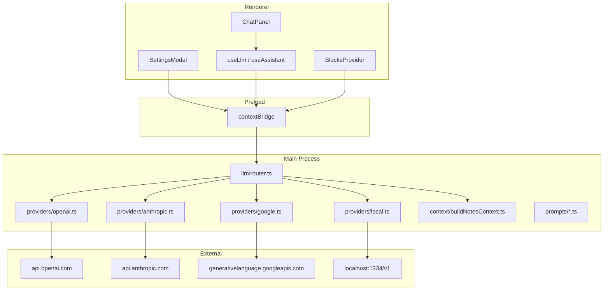

# AI Implementation Plan for Prognotic

## Current State (What You Have)

The codebase is a solid **local-first note app** with capture, goals, and block plumbing — but **no LLM layer exists yet**.

| Area | Status |
|------|--------|
| **Dictation (Whisper BYOK)** | Fully implemented — best reference pattern for AI |
| **Assistant panel** (`ChatPanel.tsx`) | UI shell with canned placeholder reply |
| **Quick actions** (translate, explain) | Stubs; only `send-to-research` works (manual category) |
| **Goal descriptions** | Collected in UI, intended for future auto-sorting |
| **Quick Notes inbox** | Works (`category: null`) — no AI routing |
| **Research category** | Manual pin via context menu |
| **System topics** (Todo Tasks, Staging Inbox) | Not built |
| **Search** | Client-side fuzzy match — not semantic |
| **API keys** | Only `whisprflowApiKey` (Whisper); plain text in `settings.json` |

**Established patterns to extend:**

```
Renderer hook (router)  →  Preload bridge  →  Main process fetch  →  External API
```

Whisper (`main/dictation/whispr.ts`) already does BYOK correctly: key read in main, never sent over IPC.

---

## Architecture Target



**Design principles:**

1. **All LLM calls in main process** — keys never reach renderer (improve on current settings leak).
2. **Provider adapter interface** — one `complete()` / `stream()` contract; four adapters.
3. **Task-based prompts** — shared infrastructure, different prompt templates per feature (chat, classify, inline action).
4. **Context assembled in main** — renderer sends intent + filters; main reads `index.json`, goals, and `.md` files.
5. **Native `fetch` first** — no SDK bloat; LM Studio uses OpenAI-compatible endpoints.
6. **Streaming via IPC events** — mirror `localDictationEvent` pattern for assistant responses.

---

## Provider Model

| Provider | Auth | Base URL | Default model examples |
|----------|------|----------|------------------------|
| **OpenAI** | `openaiApiKey` | `https://api.openai.com/v1` | `gpt-4o-mini` |
| **Anthropic** | `anthropicApiKey` | `https://api.anthropic.com/v1` | `claude-sonnet-4-20250514` |
| **Google Gemini** | `googleApiKey` | `https://generativelanguage.googleapis.com/v1beta` | `gemini-2.0-flash` |
| **Local (LM Studio)** | none | `http://localhost:1234/v1` | user-selected loaded model |

**Settings schema** (extend `AppSettings` in `shared/models.ts`):

```typescript
export type LlmProvider = 'openai' | 'anthropic' | 'google' | 'local'

export type LlmSettings = {
  provider: LlmProvider
  model: string                    // cloud model id or local model name
  openaiApiKey: string
  anthropicApiKey: string
  googleApiKey: string
  localBaseUrl: string             // default: http://localhost:1234/v1
}
```

Keep `whisprflowApiKey` separate for now (dictation vs chat are different concerns). Optionally add "use same OpenAI key" UX later.

**Renderer-safe settings:** expose `hasOpenaiKey: boolean` etc. from main; never return raw keys to renderer after save.

---

## Phased Roadmap

### Phase 1 — LLM Foundation Layer ⭐ **NEXT STEP**

**Goal:** One working AI call from Settings → Assistant, any provider.

| # | Task | Files / areas |
|---|------|---------------|
| 1.1 | Add `LlmProvider`, `LlmSettings`, IPC types | `shared/models.ts`, `shared/types.ts` |
| 1.2 | Extend `defaultSettings`, `clampSettings()` | `shared/constants.ts`, `main/lib/index.ts` |
| 1.3 | Provider adapters (complete + stream) | `main/llm/providers/{openai,anthropic,google,local}.ts` |
| 1.4 | Router: pick provider, validate key, normalize errors | `main/llm/router.ts` |
| 1.5 | IPC: `llmComplete`, `llmStream` (start/cancel), `llmStreamEvent` | `main/index.ts`, `preload/index.ts` |
| 1.6 | Settings UI: provider radio, model field, key fields, base URL, **Test connection** | `SettingsModal.tsx` |
| 1.7 | `useLlm` hook (router like `useDictation`) | `hooks/useLlm.tsx` |
| 1.8 | Wire `ChatPanel` to real LLM (non-streaming OK for v1) | `ChatPanel.tsx` |
| 1.9 | Mask API keys in renderer (`getPublicSettings`) | `main/lib`, `SettingsProvider` |

**Exit criteria:**

- User picks provider, enters key, clicks Test → success/failure message.
- Assistant panel returns a real model response (even without note context yet).
- Keys not visible in DevTools after save.

**Suggested file tree:**

```
note-app/src/main/llm/
  router.ts
  types.ts
  providers/
    openai.ts      # also used for LM Studio (local)
    anthropic.ts
    google.ts
  prompts/
    system.ts      # base assistant persona
```

---

### Phase 2 — Note-Aware Assistant (Conversational Retrieval)

**Goal:** "Summarize my Work notes from this week" with block citations.

| # | Task |
|---|------|
| 2.1 | `buildNotesContext()` in main — load blocks, filter by goal/date/query |
| 2.2 | IPC: `assistantQuery({ message, goalId?, dateRange?, blockIds? })` |
| 2.3 | Prompt template: system + injected note excerpts + user question |
| 2.4 | Citation format in response (`[block:uuid]` or clickable refs) |
| 2.5 | Streaming in `ChatPanel` (token-by-token) |
| 2.6 | Scope chips in chat UI: "All notes" / current goal / date filter |

**Context strategy (no embeddings yet):**

1. Fuzzy-search blocks matching user query (reuse existing search logic, move to shared util).
2. Rank by recency + match score.
3. Inject top N excerpts (token budget ~8–12k chars).
4. LLM synthesizes with citations.

This ships fast and matches your existing fuzzy search. Embeddings come in Phase 7+.

---

### Phase 3 — Quick Note Auto-Routing (Core Differentiator)

**Goal:** Blocks captured in Quick Notes get AI-sorted into goals with confidence scores.

| # | Task |
|---|------|
| 3.1 | Extend `BlockMeta` with routing metadata | `shared/models.ts` |
| 3.2 | Post-capture hook in `BlocksProvider.submitQuickNote` when `category === null` |
| 3.3 | IPC: `classifyBlock({ blockId, content })` |
| 3.4 | Classification prompt: goals + descriptions + optional weighting tokens `<[phrase]>` |
| 3.5 | Structured JSON output: `{ assignments: [{ goalId, confidence }], suggestNewGoal?, systemTags? }` |
| 3.6 | Apply via `updateBlockCategories` (multi-goal support already exists) |
| 3.7 | Daily retention UI on Quick Notes — show "Routed to Work (87%)" tag |
| 3.8 | Double-click override — manual goal picker |
| 3.9 | Optional: auto-create goal when confidence low + `suggestNewGoal` |

**New `BlockMeta` fields:**

```typescript
routing?: {
  decidedAt: number
  assignments: { goalId: string | null; confidence: number }[]
  model: string
  overridden?: boolean
}
```

**System topic detection** (subset of classification):

- Action items → `todo` category (add constant like `researchCategory`)
- Questions / unknowns → `research` (already exists)
- Defer full "Todo Tasks" sidebar until this lands

---

### Phase 4 — Inline AI Actions

**Goal:** Highlight text → translate, explain, calculate, etc.

| # | Task |
|---|------|
| 4.1 | Wire `quickActions.ts` handlers in `BlockContextMenu` |
| 4.2 | IPC: `inlineAction({ actionId, selectedText, blockContext? })` |
| 4.3 | Action-specific prompts (translate → target language setting later) |
| 4.4 | Result UI: modal or inline replacement (user confirms before save) |
| 4.5 | AI-generated block summaries for `blockLabel()` / excerpts |

---

### Phase 5 — Dictation Cleanup Pipeline

**Goal:** Vision: "AI cleans up grammatical errors and filler words before saving."

| # | Task |
|---|------|
| 5.1 | Optional post-transcription `cleanTranscript` LLM pass |
| 5.2 | Settings toggle: "Polish dictation with AI" |
| 5.3 | Runs before `appendTranscript` — user still reviews |

Depends on Phase 1; lower priority than routing/assistant.

---

### Phase 6 — Staging Inbox & Research Agent

**Goal:** AI research lands in a holding zone; user approves before merge.

| # | Task |
|---|------|
| 6.1 | Add `staging` system category + sidebar row |
| 6.2 | `BlockMeta.source: 'user' | 'ai'` + `stagingStatus: 'pending' | 'approved'` |
| 6.3 | Research job queue in main (`research/jobs.ts`) |
| 6.4 | Web fetch tool (link crawling from notes) |
| 6.5 | Generate structured research blocks → staging only |
| 6.6 | Approval UI: tick to merge into target goal |

---

### Phase 7 — Advanced (Later)

| Feature | Approach |
|---------|----------|
| **Semantic search** | Local embeddings (e.g. `transformers.js` or API embeddings) + vector index |
| **Knowledge graph** | D3/canvas viz from routing confidence + timestamps |
| **Multimodal** | Vision API for image OCR / nutrition labels |
| **Encrypted key storage** | `safeStorage` or OS keychain via Electron |

---

## Priority: What to Build Now

**Start Phase 1 immediately.** Nothing else in the AI vision works without it.

### Phase 1 implementation sequence (1–2 weeks)

```
Week 1 — Backend
├── Day 1–2: Types, settings schema, clampSettings, masked getPublicSettings
├── Day 3–4: OpenAI + Local adapters (LM Studio = OpenAI client with custom baseUrl)
├── Day 5:   Anthropic + Gemini adapters
└── Day 6–7: Router, IPC, streaming events, testConnection handler

Week 2 — Frontend
├── Day 1–2: SettingsModal LLM section + test button
├── Day 3:   useLlm hook
├── Day 4–5: ChatPanel wired to llmComplete (no note context yet)
└── Day 6:   Polish errors, loading states, provider-specific hints
```

### Minimal IPC surface (Phase 1)

```typescript
// shared/types.ts
type LlmMessage = { role: 'system' | 'user' | 'assistant'; content: string }

type LlmComplete = (messages: LlmMessage[]) => Promise<{ text: string } | { error: string }>
type LlmStreamStart = (messages: LlmMessage[]) => Promise<{ ok: boolean; error?: string }>
type LlmStreamCancel = () => Promise<void>
type OnLlmStreamEvent = (cb: (e: { type: 'token'; text: string } | { type: 'done' } | { type: 'error'; message: string }) => void) => () => void
type TestLlmConnection = () => Promise<{ ok: boolean; error?: string; model?: string }>
type GetPublicSettings = () => Promise<PublicAppSettings>  // keys masked
```

### Provider adapter interface

```typescript
// main/llm/types.ts
export type LlmAdapter = {
  complete(messages: LlmMessage[], model: string): Promise<string>
  stream(messages: LlmMessage[], model: string, onToken: (t: string) => void): Promise<void>
  testConnection(model: string): Promise<void>  // throws on failure
}
```

---

## Mapping Vision → Phases

| Product vision | Phase | Notes |
|----------------|-------|-------|
| BYOK: OpenAI, Claude, Gemini | **1** | Settings + adapters |
| Local LLM (LM Studio) | **1** | OpenAI-compatible adapter |
| Conversational retrieval | **2** | Needs Phase 1 + context builder |
| Quick Note auto-routing | **3** | Highest product value after foundation |
| Weighting tokens `<[...]>` | **3** | Prompt parsing in classifier |
| Todo / Research system topics | **3** | Classification tags → categories |
| Inline AI on highlight | **4** | Quick actions already stubbed |
| Dictation cleanup | **5** | Optional polish |
| Staging Inbox + deep research | **6** | New category + job queue |
| Knowledge graph | **7** | Experimental, needs embeddings |

---

## Technical Decisions (Recommendations)

| Decision | Recommendation | Rationale |
|----------|----------------|-----------|
| SDK vs fetch | **fetch** | Matches Whisper; zero new deps |
| LM Studio | **OpenAI adapter + `localBaseUrl`** | LM Studio exposes `/v1/chat/completions` |
| Key storage | **Main-only reads; masked public settings** | Security upgrade over current pattern |
| Streaming | **IPC events from day 1** | Better UX; pattern exists (dictation) |
| Embeddings | **Defer to Phase 7** | Fuzzy search + excerpt injection is enough for v1 assistant |
| Model defaults | **Cheap/fast models** | `gpt-4o-mini`, `claude-3-5-haiku`, `gemini-2.0-flash` |
| Error handling | **User-facing messages** | Mirror `whispr.ts` 401/network errors |

---

## Risks & Mitigations

| Risk | Mitigation |
|------|------------|
| Context window overflow | Token budget in `buildNotesContext`; truncate oldest/lowest-relevance first |
| Classification hallucination | Structured JSON + confidence threshold; stay in Quick Notes if < 0.5 |
| API cost | Use mini/flash models; batch classify only on Quick Notes capture |
| Local model quality | Let user pick model; show warning in Settings for routing tasks |
| Key exposure in renderer | `getPublicSettings` returns booleans only |

---

## Summary

**You are here:** capture plumbing, goals, dictation, and assistant UI shell — but **zero LLM infrastructure**.

**Next step:** **Phase 1 — LLM Foundation Layer**

- Provider settings (OpenAI, Anthropic, Gemini, LM Studio)
- Main-process adapters + IPC
- Test connection in Settings
- Real responses in `ChatPanel` (general chat first, note context in Phase 2)

**Then:** Phase 2 (note-aware assistant) → Phase 3 (Quick Note auto-routing), which delivers the core product promise from the product vision.
