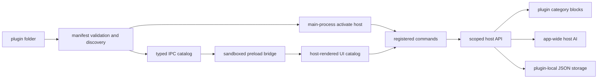

# Prognotic plugin developer guide

Prognotic v1 plugins are folders that contain a validated `plugin.json` manifest and a CommonJS main-process entry. The renderer never loads plugin JavaScript. Instead, the manifest selects from a bounded UI catalog that Prognotic renders, while command logic uses a scoped host API in the main process.

The current signature is `prognotic-plugin/v1`. It is a format marker, not cryptographic code signing.

## Install and iterate

The live plugin directory is `~/NoteMark/plugins/`. Each immediate child directory is one plugin:

```text
~/NoteMark/
├── plugins/
│   └── my-plugin/
│       ├── plugin.json
│       └── index.cjs
├── plugin-state.json
└── plugin-data/
    └── my-plugin.json
```

In a built app:

1. Open **Settings → Manage plugins**.
2. Choose **Open folder** and copy the complete plugin folder into it.
3. Choose **Refresh**. Invalid plugins remain listed with the validation reason.
4. Enable the plugin. A plugin with a sidebar declaration appears below Research and above Pinned/Goals.
5. After changing `plugin.json` or the entry file, choose **Refresh**. An enabled plugin is deactivated and reactivated when either timestamp changes.

Enabled ids and manifest configuration live in `plugin-state.json`. Disabling or removing a plugin does not delete its note blocks. Removing deletes only the selected plugin folder and its saved manager configuration; plugin-local data and note blocks remain.

## Architecture



`plugin.json` controls metadata, permissions, configuration fields, sidebar placement, AI baseline instructions, and view composition. `index.cjs` exports `activate(host)` and registers every command referenced by the UI. Prognotic validates the manifest before requiring the entry and refuses activation when a rendered command is missing.

There are no arbitrary renderer bundles, DOM injection, Node integration in the renderer, or plugin access to AI credentials.

## Manifest reference

This is a complete compact example. See [`resources/plugins/_template/plugin.json`](../resources/plugins/_template/plugin.json) for a copy-ready version.

```json
{
  "id": "daily-log",
  "name": "Daily Log",
  "version": "1.0.0",
  "description": "Capture and review daily entries.",
  "signature": "prognotic-plugin/v1",
  "entry": "index.cjs",
  "permissions": { "blocks": "own", "ai": true },
  "ai": {
    "systemPrompt": "Help organize daily log entries. Never invent missing facts."
  },
  "sidebar": { "label": "Daily Log", "icon": "puzzle" },
  "configSchema": [
    {
      "key": "heading",
      "label": "New entry heading",
      "type": "string",
      "default": "Entry"
    }
  ],
  "ui": {
    "type": "note-feed",
    "layout": ["header", "capture", "stat-row", "empty-state", "grouped-list"],
    "capture": {
      "command": "addEntry",
      "label": "Add entry",
      "placeholder": "What happened?"
    },
    "entry": {
      "type": "entry",
      "editor": { "type": "entry-editor", "command": "saveEntry" },
      "deleteCommand": "deleteEntry",
      "actions": [
        {
          "type": "action",
          "command": "summarizeEntry",
          "label": "Summarize",
          "tone": "ai",
          "aiPrompt": "Return two short Markdown bullets."
        }
      ]
    }
  }
}
```

### Top-level fields

| Field | Required | Implemented contract |
|---|---:|---|
| `id` | yes | Stable lowercase id: starts with `a-z`, then lowercase letters, digits, or hyphens; maximum 64 characters. It becomes the block namespace `plugin:{id}`. |
| `name` | yes | Display name, maximum 80 characters. |
| `version` | yes | Semantic version such as `1.2.3` or `1.2.3-beta.1`. |
| `description` | yes | Description shown in manager/view, maximum 500 characters. |
| `signature` | yes | Exactly `prognotic-plugin/v1`. Metadata marker only. |
| `entry` | yes | Relative `.js` or `.cjs` path inside the plugin folder. Absolute paths and `..` are rejected; the referenced file must exist. |
| `permissions.blocks` | no | The only accepted value is `"own"`. It documents access to the plugin-owned block namespace. |
| `permissions.ai` | no | Must be `true` before `host.ai.complete` can run. Manifest/action AI prompts also require it. |
| `ai.systemPrompt` | no | Plugin-wide AI instruction, maximum 24,000 characters. It is appended after the fixed host baseline. |
| `sidebar` | no | `label` plus optional `icon`. Implemented icon names are `utensils`, `leaf`, `heart`, `sparkles`, and `puzzle`; unknown names fall back to puzzle. |
| `configSchema` | no | Up to 50 manager-rendered fields. Keys must be unique and start with a letter. |
| `ui` | no | A host-rendered `note-feed` primary view. No custom HTML or React entry is accepted. |

Discovery sorts folder names lexically. For duplicate valid ids, the first folder wins; later duplicates remain visible as unusable. An invalid folder never reserves an id.

### Configuration fields

All fields require `key`, `label`, and `type`; `description` is optional.

| Type | Additional fields |
|---|---|
| `string` | Optional string `default`. Values are limited to 10,000 characters. |
| `number` | Optional finite `default`, `min`, and `max`. The default must be within the range. |
| `boolean` | Optional boolean `default`. |
| `select` | `options: [{ "label", "value" }]` with 1–50 unique values, plus an optional matching `default`. |

Read normalized values at command time with `await host.getConfig()`. Configuration is local and is not a credential store.

## Host-rendered UI catalog

`ui.type` is currently only `note-feed`. `ui.layout` is an ordered array with at most 30 elements. Major elements accept a string shorthand; object form adds options. Unknown names or object types invalidate the manifest.

| Element | Placement and fields | Command input |
|---|---|---|
| `header` | Top-level. Uses plugin label/description and review count. Object options: `title`, `description`, `showReviewCount`. | none |
| `capture` | Top-level textarea/button. String form reads `ui.capture`; object form contains `command`, `label`, and optional `placeholder`. | `{ text }` |
| `stat-row` | Top-level summary chips. `items` uses `{ key, label }`; keys are `today`, `unvisited`, or `total`. String form uses `ui.stats`, then host defaults. | none |
| `list` | Top-level flat list. Optional nested `entry`; otherwise uses `ui.entry` or legacy entry settings. | depends on entry controls |
| `grouped-list` | Top-level grouped list. `groupBy` is `today-recent` (default) or `day`; optional `labels.today`/`labels.recent`; optional nested `entry`. | depends on entry controls |
| `entry` | Nested under `list`/`grouped-list` or set once as `ui.entry`. Options: `content: "body" | "excerpt"`, `showTimestamp`, `showReviewBadge`, `editor`, `deleteCommand`, `actions`. | host-rendered container |
| `entry-editor` | Nested as `entry.editor`; requires a save `command`. Prognotic owns open/cancel state. | `{ blockId, content }` on save |
| `action` | Nested under an entry or top-level. Requires `command` and `label`; optional `tone`, `showWhen`, and `aiPrompt`. | entry: `{ blockId }`; top-level: `{}` |
| `empty-state` | Top-level; renders only after an empty list has loaded. Optional `message`, otherwise `ui.emptyState`/host default. | none |
| `section-label` | Top-level object with `label`; renders the standard uppercase heading. Grouped lists use the same host heading internally. | none |

Action `tone` is `default`, `ai`, or `review`. `showWhen` is `always` (default) or `unvisited`. An entry action with `unvisited` is shown only for an unacknowledged block; a top-level action uses the plugin review count. `aiPrompt`, up to 12,000 characters, becomes the action AI layer whenever that command calls `host.ai.complete`.

Every manifest-declared interactive operation has a command: capture submit, editor save, delete, and action buttons. The edit-open and cancel buttons are host-owned UI state and do not invoke plugin logic. On activation, every command reachable from the chosen layout must exist in the returned `commands` map.

### Structured entry example

```json
{
  "type": "grouped-list",
  "groupBy": "today-recent",
  "labels": { "today": "Today", "recent": "Earlier" },
  "entry": {
    "type": "entry",
    "content": "body",
    "showTimestamp": true,
    "showReviewBadge": true,
    "editor": { "type": "entry-editor", "command": "saveEntry" },
    "deleteCommand": "deleteEntry",
    "actions": [
      {
        "type": "action",
        "command": "analyzeEntry",
        "label": "Analyze",
        "tone": "ai",
        "showWhen": "always",
        "aiPrompt": "Return concise Markdown with a Findings heading."
      },
      {
        "type": "action",
        "command": "reviewEntry",
        "label": "Mark reviewed",
        "tone": "review",
        "showWhen": "unvisited"
      }
    ]
  }
}
```

### Legacy `note-feed` compatibility

An installed v1 manifest without `layout` continues to render as header → optional capture → empty state → Today/Recent grouped list. These fields remain valid:

```json
{
  "type": "note-feed",
  "emptyState": "No entries yet.",
  "capture": { "command": "addEntry", "label": "Add" },
  "editCommand": "saveEntry",
  "deleteCommand": "deleteEntry",
  "actions": [{ "command": "reviewEntry", "label": "Review" }]
}
```

## Main entry and commands

The entry is CommonJS and must export `activate` (or `default.activate`). Activation may return a registration synchronously or asynchronously:

```js
'use strict'

exports.activate = (host) => ({
  commands: {
    addEntry: async (input) => {
      const text = typeof input.text === 'string' ? input.text.trim() : ''
      if (!text) throw new Error('Write an entry first.')
      const block = await host.blocks.createBlock(text)
      await host.blocks.setPresence(block.id, false)
      host.notify('Entry added.', { tone: 'success' })
      return { blockId: block.id }
    }
  },
  deactivate: async () => {
    // Release timers or other resources created during activation.
  }
})
```

Activation times out after 10 seconds. Command names start with a letter and may contain letters, numbers, `.`, `_`, or `-` (maximum 80 characters).

The host passes a copy of one of these shapes:

```ts
type PluginCommandInput = {
  text?: string       // capture
  blockId?: string    // entry editor/action/delete
  content?: string    // entry editor save
}
```

A command can return nothing or `{ message?: string, blockId?: string }`. Messages are truncated to 500 characters and ids to 100. Throw an `Error` for an operation failure; Prognotic catches it and shows the message. AI readiness is different: `host.ai.complete` returns `{ error }`, so commands commonly convert that to a thrown error after any local cleanup.

`host.notify(message, { tone })` is the preferred success/info/error status. Notifications emitted while a command runs are returned through IPC and the host view displays the most recent one. A returned command `message` remains supported and is used when there is no notification.

## Host API reference

The standalone declarations in [`resources/plugins/plugin-host.d.ts`](../resources/plugins/plugin-host.d.ts) mirror this interface for JavaScript/TypeScript editors. They are declarations only; plugins need no build step.

### Identity and configuration

```ts
host.pluginId: string
host.categoryId: string              // plugin:{pluginId}
host.getConfig(): Promise<Record<string, string | number | boolean>>
```

### Scoped note blocks

```ts
host.blocks.createBlock(content, categories?)
host.blocks.readBlock(id)             // full owned metadata + content
host.blocks.getMeta(id)               // safe metadata, no content/file/category internals
host.blocks.writeBlock(id, content)
host.blocks.deleteBlock(id)
host.blocks.deleteBlockIfEmpty(id)
host.blocks.updateBlockCategories(id, categories)
host.blocks.appendToBlock(id, text)
host.blocks.listBlocks(filter?)
host.blocks.getPresence(id, category?)
host.blocks.setPresence(id, visited, category?)
host.blocks.acknowledgePresence(id, category?)
```

`createBlock` and `updateBlockCategories` accept no categories or exactly `[host.categoryId]`; any other category is denied. All id operations first verify that the block includes `plugin:{pluginId}`. `listBlocks` accepts `category`, `createdAfter`, `updatedAfter`, and `limit`; category can only be `host.categoryId`, the limit is clamped to 1–200 (default 100), and newest entries come first.

Block content is limited to 1,000,000 characters, appended text to 100,000. `deleteBlockIfEmpty` follows the app's normal empty-block definition. Existing persistence, index locking, excerpts, and atomic index writes remain owned by Prognotic.

`getMeta` returns only:

```ts
{
  id: string
  createdAt: number
  updatedAt: number
  excerpt: string
  aiLabel?: string
  presence: GoalPresence | null
}
```

Presence defaults to the plugin category. `setPresence(id, false)` creates the same unvisited/review state used by core goal badges; `acknowledgePresence` marks it visited.

### Host AI

```ts
host.ai.complete({
  prompt: string,
  system?: string,
  blockId?: string,
  maxTokens?: number
}): Promise<{ text: string } | { error: string }>
```

The manifest must declare `permissions.ai: true`. A referenced `blockId` must be plugin-owned. The prompt is limited to 12,000 characters, the call-specific system addendum to 4,000, referenced content to 8,000, and output to 64–2,048 tokens (default 800). Requests time out after 60 seconds.

Host AI uses the app-wide verified connection. Plugins never receive provider settings, model names, tokens, or credentials. If AI is not ready, the API returns: `AI is not ready. Choose a model and test the connection in Settings.`

### Plugin-local storage

```ts
host.storage.get(key): Promise<PluginStorageValue | null>
host.storage.set(key, value): Promise<boolean>
```

Values must be finite, acyclic JSON data: string, number, boolean, null, arrays, or plain objects. Keys start with a letter and use letters, numbers, `.`, `_`, or `-` (maximum 80 characters). Each value is at most 64 KB; each plugin file is at most 256 KB and 128 keys. Files are atomic JSON writes under `~/NoteMark/plugin-data/{pluginId}.json`.

There is no delete method in v1; set a key to `null` when appropriate. Storage is for preferences, cursors, and lightweight derived state—not credentials or secrets.

### Notifications

```ts
host.notify(message, { tone?: 'info' | 'success' | 'error' }): PluginNotification
```

Messages must be non-empty and are limited to 500 characters. Up to 20 notifications are retained for one command. Use notifications during a registered command so the host can surface them with that command result.

## AI prompt layering

Prognotic builds one system message in this non-overridable order:

1. **Host baseline** — fixed safety and privacy rules, note content treated as data, bounded context, requested output only, and no discussion of provider/model/credentials.
2. **Plugin baseline** — optional `manifest.ai.systemPrompt` (24,000 characters).
3. **Action instruction** — optional `aiPrompt` on the currently running manifest action (12,000 characters).
4. **Call addendum** — optional `input.system` supplied by `host.ai.complete` (4,000 characters).
5. **User/task prompt** — required `input.prompt`, sent as the user message, followed by an optional owned note block clearly marked as data.

Later layers may specialize the task but do not replace the host baseline. The action layer is selected from the command currently running, so an `analyzeMeal` action prompt applies automatically when that command calls AI.

Example:

```json
"ai": {
  "systemPrompt": "Estimate dietary values cautiously and label uncertainty."
}
```

```json
{
  "type": "action",
  "command": "analyzeMeal",
  "label": "Analyze",
  "tone": "ai",
  "aiPrompt": "Return foods, estimated calories, macros, and one short summary."
}
```

```js
const result = await host.ai.complete({
  blockId,
  system: includeMacros ? 'Include a macro table.' : 'Omit the macro table.',
  prompt: 'Analyze the referenced meal entry.',
  maxTokens: 900
})
```

## Dietary reference walkthrough

The bundled Dietary plugin is the executable reference:

- [`resources/plugins/dietary/plugin.json`](../resources/plugins/dietary/plugin.json) declares the namespace/AI permissions, manager configuration, plugin-wide dietary prompt, ordered layout, stat row, grouped list, editor, review action, and action-specific analysis prompt.
- [`resources/plugins/dietary/index.cjs`](../resources/plugins/dietary/index.cjs) registers `addMeal`, `updateMeal`, `deleteMeal`, `analyzeMeal`, and `markReviewed`.

`addMeal` creates a block in `plugin:dietary`, marks its presence unvisited, stores the last id, and emits a success notification. Edit uses safe metadata before writing. Delete leaves unrelated plugin data/blocks untouched. Analyze reads only the selected Dietary block, calls host AI, appends Markdown, and returns the block to needs-review state. Mark reviewed uses the standard acknowledgement helper.

The resource is seeded into `~/NoteMark/plugins/dietary/` only when Dietary has never been seeded and that destination does not already exist. Prognotic never overwrites a user's installed Dietary folder.

## Build your own plugin

1. Locate `resources/plugins/_template/` in this repository. In the current packaged app it is unpacked at `<installation>/resources/app.asar.unpacked/resources/plugins/_template/`. Copy it to `~/NoteMark/plugins/hello-plugin/`.
2. Change `id`, `name`, `description`, sidebar label, and commands as needed. Keep the signature and a semantic version.
3. Keep the entry self-contained CommonJS (`index.cjs`) unless you understand Node's module cache. No npm install or renderer build is required for the starter.
4. Use only manifest UI elements documented above; register every referenced command from `activate(host)`.
5. Optionally copy `resources/plugins/plugin-host.d.ts` into the development project and import its types in editor-only JSDoc or TypeScript source.
6. In **Manage plugins**, Refresh and enable it. Select its sidebar row, capture an entry, then test edit/action/review/delete.
7. Edit the entry or manifest and Refresh. Prognotic reloads when the main manifest/entry timestamp changes.

The template works unchanged. Its AI action reports the normal friendly readiness error until app-wide AI has been verified.

## Troubleshooting

| Symptom | Check |
|---|---|
| Plugin is listed as unusable | Read the manager reason. Common causes are an incorrect signature, missing required metadata, invalid semantic version/id, unknown UI element, path traversal in `entry`, missing entry file, or duplicate id. |
| Enable immediately turns off | Entry activation failed, timed out, returned an invalid registration, or omitted a command referenced by the rendered layout. The manager includes the entry error. |
| Sidebar row is missing | The plugin must be valid, enabled, and have completed activation. Refresh after copying files. |
| Code changes do not appear | Save `plugin.json` or the declared entry, then Refresh. Required helper modules may remain in Node's module cache; for multi-file code, disable/re-enable or restart when necessary. |
| AI action says AI is not ready | Verify the app-wide AI connection in Settings. Plugins cannot configure or inspect it. |
| AI action does not use its action prompt | Put `aiPrompt` on the `action` element for the same command that calls `host.ai.complete`, and declare `permissions.ai: true`. |
| A block operation is denied | The id/category is outside `plugin:{pluginId}`, or the block was removed. Use `host.categoryId` and ids returned by this plugin's host calls. |
| Storage write fails | Check the key pattern, JSON compatibility, 64 KB value bound, 128-key limit, and 256 KB plugin-file bound. |
| Capture/editor cannot focus in a host build | Standard host controls already opt out of Electron drag regions. App contributors adding new draggable headers must keep inputs, textareas, selects, contenteditable surfaces, and buttons in `no-drag` regions. Plugins cannot inject markup or drag CSS. |

## Current limitations and trust model

- There is no marketplace, remote install, auto-update, or dependency installer.
- UI is limited to the documented host-rendered `note-feed` catalog; no custom React, HTML, CSS, browser iframe, or assistant-panel integration is supported.
- Entries are main-process CommonJS. They are not a security sandbox: enabled code is trusted and can inherit Node/main-process capabilities even though the host API itself exposes no raw filesystem, credentials, other goals, assistant conversations, or unscoped notes. Install only code you trust.
- The signature is metadata-only, not publisher identity or cryptographic verification.
- Block access is only the plugin's `plugin:{id}` namespace. There are no cross-plugin APIs.
- Plugin storage is local JSON and deliberately not suitable for secrets.
- Refresh reloads the declared manifest/entry on timestamp changes, but CommonJS helper-module caching can require disable/re-enable or restart.
- Removing/disabling a plugin does not clean up its note blocks or `plugin-data` file.
